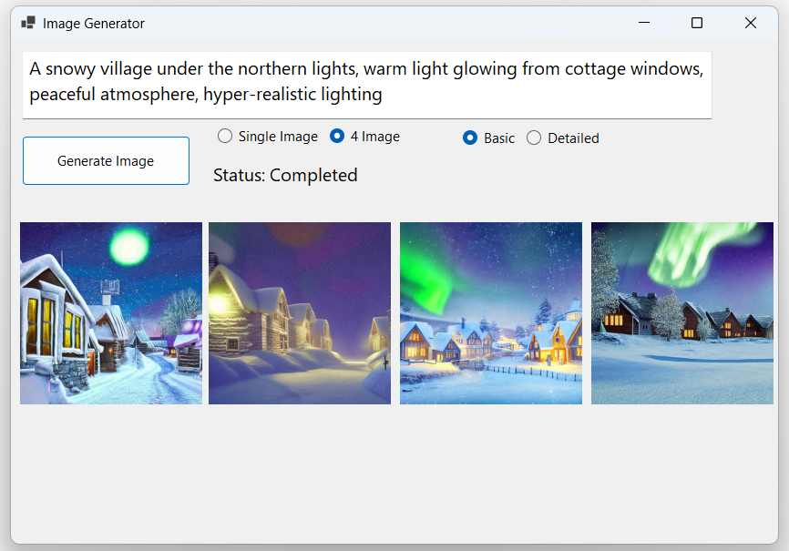

Image Generator with Stable Diffusion

This is a Windows desktop application that uses Stable Diffusion to generate AI images. You can enter a prompt and choose options to image generation. The application uses a bridge to call Python functions within the desktop application.

